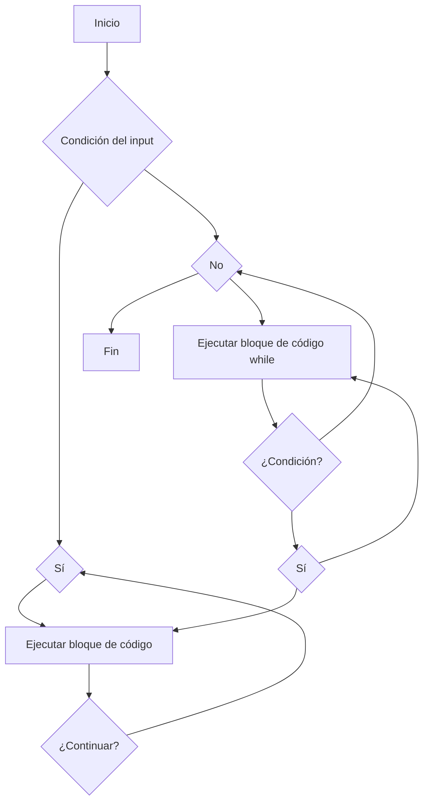

# Unidad III:   Programando con R

# Clase del sábado 28-05-2024

La programación implica escribir sistemas de instrucciones relativamente complejos.
Hay dos estilos amplios de programación: el estilo **imperativo** implica encadenar 
instrucciones que le dicen a la computadora qué hacer. El estilo **declarativo** implica
escribir una descripción del resultado final, sin dar detalles sobre cómo
para llegar allí.

##  **Control del flujo "flow" DETERMINISTA**



**Explicación del diagrama:**

* El diagrama comienza en el nodo **A (Inicio)**.
* Desde **A**, hay una pregunta que decide si se debe usar un bucle **for** o un bucle **while**.
* Si la respuesta a la pregunta es **sí** (nodo **B**), el flujo pasa al nodo **C (Ejecutar bloque de código)**.
* Dentro del bucle **for**, el bloque de código se ejecuta (nodo **D**).
* Luego, hay otra pregunta que decide si se debe continuar con el bucle (nodo **E**).
* Si la respuesta es **sí**, el flujo vuelve al nodo **C** para ejecutar el bloque de código nuevamente.
* Si la respuesta es **no**, el flujo sale del bucle **for** y pasa al nodo **F (No)**.
* Si la respuesta a la pregunta inicial (nodo **B**) es **no**, el flujo pasa directamente al nodo **G (Ejecutar bloque de código while)**.
* Dentro del bucle **while**, el bloque de código se ejecuta (nodo **D**).
* Luego, la condición del bucle se evalúa en el nodo **H (¿Condición?)**.
* Si la condición es **sí**, el flujo vuelve al nodo **G** para ejecutar el bloque de código nuevamente.
* Si la condición es **no**, el flujo sale del bucle **while** y pasa al nodo **F (No)**.
* Finalmente, el flujo termina en el nodo **J (Fin)**.
* 
### El loop *for ( )*

Calculo de un factorial:

```r
n <- 100
result <- 1
for (i in 1:n)
result <- result * i
result
```
Calculo de la sequencia de Fibonacci:

```r
Fibonacci <- numeric(12)
Fibonacci[1] <- Fibonacci[2] <- 1
for (i in 3:12)
Fibonacci[i] <- Fibonacci[i - 2] + Fibonacci[i - 1]
```


### El condicionador *if (  )*

Syntax

```r
if (condition) {commands when TRUE}
if (condition) {commands when TRUE} else {commands when FALSE}
```
Un ejemplo simple

```r
x <- 3
if (x > 2) y <- 2 * x else y <- 3 * x
```

```r
Eratosthenes <- function(n) {
# Return all prime numbers up to n (based on the sieve of Eratosthenes)
if (n >= 2) {
sieve <- seq(2, n)
primes <- c()
for (i in seq(2, n)) {
if (any(sieve == i)) {
primes <- c(primes, i)
sieve <- c(sieve[(sieve %% i) != 0], i)
}
}
return(primes)
} else {
stop("Input value of n should be at least 2.")
}
}

Eratosthenes(50)
```

### El loop *while ( )*

Syntax
```r
while (condition) {statements}

```

Calculo de números de la secuencia de Fibonacci:
```r
Fib1 <- 1
Fib2 <- 1
Fibonacci <- c(Fib1, Fib2)
while (Fib2 < 300) {
Fibonacci <- c(Fibonacci, Fib2)
oldFib2 <- Fib2
Fib2 <- Fib1 + Fib2
Fib1 <- oldFib2
}

Fibonacci

```

```r
```
### El loop *repeat* y el *break* y proximos declaraciones

Syntax
```r
repeat { statements } if (condition) break
```

```r
x <- x0
tolerance <- 0.000001
repeat {
f <- xˆ3 + 2 * xˆ2 - 7
if (abs(f) < tolerance) break
f.prime <- 3 * xˆ2 + 4 * x
x <- x - f / f.prime
}
x
```

```r
```


## *GESTION DE LA COMPLEJIDAD ATRAVEZ DE FUNCIONES*

La mayoría de los programas informáticos reales son mucho más largos que los ejemplos que damos en este libro. La mayoría de las personas no pueden tener todos los detalles en la cabeza a la vez, por lo que es extremadamente importante encontrar formas de reducir la complejidad. A lo largo de los años se han desarrollado diversas estrategias de diseño de programas. En esta sección damos un breve resumen de algunas de las estrategias que nos han funcionado.

Las funciones son unidades autónomas de código R con un propósito bien definido. En general, las funciones toman entradas, hacen cálculos (posiblemente imprimiendo resultados intermedios, dibujando gráficos, llamando a otras funciones, etc.) y producen resultados. Si las entradas y salidas están bien definidas, el programador puede estar razonablemente seguro de si la función funciona o no: y una vez que funciona, puede pasar al siguiente problema.


### ¿Qué son las funciones?

En el análisis de datos, podrías definir funciones para realizar tareas comunes como la limpieza de datos, la transformación de datos, o el ajuste de modelos. Por ejemplo, aquí hay una función que podría usar para calcular la media de una columna en un dataframe:

Sintaxis
```r
func_name <- function (parameters) {
statement
}
```

```r
annuityAmt <- function(n, R, i) {
R*((1 + i)ˆn - 1) / i
}
annuityAmt(10, 400, 0.05)
```

```r
# define a function to compute power
power <- function(a = 2, b) {
    print(paste("a raised to the power b is: ", a^b))
}

# call the power function with arguments
power(2, 3)

# call function with default arguments
power(b=3)
```

```r
# define a function to compute power
power <- function(a, b) {
    return (a^b)
}

# call the power function with arguments
print(paste("a raised to the power b is: ", power(2, 3)))
```


### Devolución de varios objetos en listas

```r
annuityValues <- function(n, R, i) {
amount <- R*((1 + i)ˆn - 1) / i
PV <- amount * (1 + i)ˆ(-n)
list(amount = amount, PV = PV)
}
annuityValues(10, 400, 0.05)
```

### Uso de clases de S3 para controlar la impresión

Una solución general a este problema es declarar el tipo de valor de retorno y decirle a R cómo imprimir cosas así. Este es un tipo de programación orientada a objetos. De hecho, hay varias formas de hacer esto y una discusión completa está más allá del alcance de este texto, pero en esta sección mostraremos una de las formas más simples: usar métodos S3.

Además de tener valores, los objetos en R pueden tener atributos con nombre. La clase S3 es (en el caso más simple) una cadena de caracteres llamada clase que contiene la clase del objeto.

```r
annuityValues <- function(n, R, i) {
amount <- R*((1 + i)^n - 1) / i
PV <- amount * (1 + i)^(-n)
list(amount = amount, PV = PV)
}

# Aplicar la función
annuityValues(10, 400, 0.05)

# Creo la clase Annuity
values <- annuityValues(10, 400, 0.05)
class(values) <- "annuity"

# Creo una forma bacana de imprimir los resultados
 
print.annuity <- function(x, ...) {
cat("An annuity object with present value", x$PV, "and final value",
x$amount, "\n")
invisible(x)
}

values

values$PV
```

# Clase del martes 28-05-2024


### El operador %>% del paquete *magrittr*

```r
# Para aplicar una función f de dos argumentos f(x,y), podemos escribir
x %% f(x, y)
# Simbolizando, dado el objeto x, aplicar la función f en los
# argumentos f(x,y)
```


```r
boxplot(Sepal.Length ~ Species, data = iris,
        ylab = "Sepal length (cm)",
        main = "Iris measurements",
        boxwex = 0.5)
```

```r
iris %>% boxplot(Sepal.Length ~ Species, data = .,
                 ylab = "Sepal length (cm)",
                 main = "Iris measurements",
                 boxwex = 0.5)
```


El operador `%>%` del paquete `magrittr` en R es muy útil para encadenar operaciones. Veamos otros dos ejemplos utilizando el conjunto de datos `iris`:
**Ejemplo 1: Resumen estadístico de las variables numéricas**
```r
library(dplyr)
library(magrittr)

iris %>%
  summarise_at(vars(-Species), funs(mean(., na.rm = TRUE), sd(., na.rm = TRUE)))
```
Este código calcula la media y la desviación estándar de todas las columnas numéricas en el conjunto de datos `iris`, excluyendo la columna `Species`.

**Ejemplo 2: Filtrado y ordenamiento**
```r
iris %>%
  filter(Species == "setosa") %>%
  arrange(desc(Sepal.Length))
```
Este código filtra el conjunto de datos `iris` para incluir solo las filas donde `Species` es "setosa", y luego ordena estas filas en orden descendente por `Sepal.Length`.

###  La función *replicate ( )*

- Replica una funcition un número **n** de veces.
- 
syntaxis
```r
replicate(n, { statements })
```

Replicar 5 veces de una muestra de 1:5
```r
replicate(5, 1:5)
```

5 muestras de tamaño 6 de una variable Normal con media 2 y varianza 1
```r
replicate(5, rnorm(6, 2,1))
```

```r

```

## *Consejos de programación miscelánea*

### Edite siempre el código en el editor, no en la consola

### La limpieza cuenta del código

Evitar errores en los códigos
```r
x1<-a+b+c
y12< -a+b+c
```

Código espaciado y simetrico
```r
x1 <- a + b + c
y12 < -a + b + c

```

### Diseño de arriba hacia abajo

```r

```
```r

```
```r

```
```r

```
```r

```
```r

```

## *Depuración y mantenimiento*

### Reconociendo errores

### Hacer que el error sea reproducible

### Identificar la causa del error

### Corrección de errores y pruebas.

### Busque errores similares en otros lugares

### Depuración en RStudio

### Funciones de *browser( )*, *debug( )*, and *debugonce( )* 

### Depuración de los operadores %>% magrittr

## *Programación eficiente*

### Aprende tus herramientas

### Algoritmos eficientes

### Mide el tiempo que tarda tu programa

### Estar dispuesto a utilizar diferentes herramientas

### Optimice con cuidado

## *Referencias*
1.  Introduction  to  Scientific  Programming and Simulation  Using R: [https://nyu-cdsc.github.io/learningr/assets/simulation.pdf](https://nyu-cdsc.github.io/learningr/assets/simulation.pdf)
2.  Advanced R: [https://adv-r.hadley.nz/](https://adv-r.hadley.nz/)

