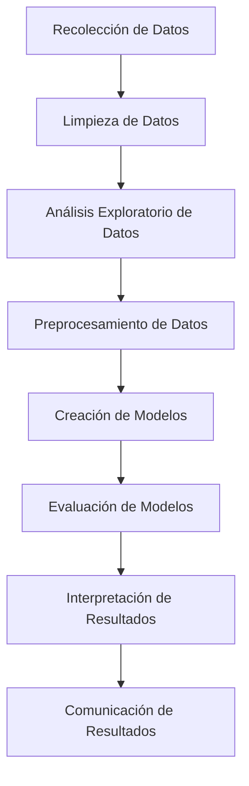

# Tópicos de rmarkdown, bookdown, shinyapps y dashboards

# Parte 0: Sintaxis en R Markdown

**Markdown** es un lenguaje de marcado ligero que puedes usar para añadir formato a texto en la web. Aquí te presento una lista de las sintaxis más comunes en Markdown:

1. **Encabezados**: Se crean utilizando el símbolo `#`. Cuantos más símbolos `#`, menor será el tamaño del encabezado. Por ejemplo:
    ```
    # Encabezado 1
    ## Encabezado 2
    ### Encabezado 3
    ```

2. **Negrita**: Se puede hacer un texto en negrita utilizando dos asteriscos `**` o dos guiones bajos `__` alrededor del texto. Por ejemplo:
    ```
    **texto en negrita**
    __texto en negrita__
    ```

3. **Cursiva**: Se puede hacer un texto en cursiva utilizando un asterisco `*` o un guión bajo `_` alrededor del texto. Por ejemplo:
    ```
    *texto en cursiva*
    _texto en cursiva_
    ```

4. **Listas**: Las listas se pueden crear utilizando un guión `-`, un asterisco `*`, o un número seguido de un punto `.`, para listas ordenadas. Por ejemplo:
    ```
    - Elemento de la lista
    * Elemento de la lista
    1. Primer elemento de la lista
    ```

5. **Enlaces**: Los enlaces se pueden crear utilizando corchetes `[]` para el texto del enlace y paréntesis `()` para la URL del enlace. Por ejemplo:
    ```
    [texto del enlace](https://www.ejemplo.com)
    ```

6. **Imágenes**: Las imágenes se pueden insertar de manera similar a los enlaces, pero con un signo de exclamación `!` antes de los corchetes. Por ejemplo:
    ```
    
    ```

7. **Código**: El código se puede representar utilizando comillas invertidas `` ` ``. Para bloques de código, puedes usar tres comillas invertidas seguidas de la identificación del lenguaje. Por ejemplo:

```
`código`
```

 Bloque de código:
 ```

Código de *Python*:
   ```python
   print("Hola, mundo!")
    ```

``` 

Código de *R*:

    ```r
    data(mtcars)
    ```

```

```

9. **Tablas**: Las tablas se pueden crear utilizando barras verticales `|` y guiones `-`. Por ejemplo:
    ```
    | Encabezado 1 | Encabezado 2 |
    | ------------ | ------------ |
    | Celda 1      | Celda 2      |
    ```

10. **Notas**: Las notas se pueden crear utilizando el símbolo `>` antes del texto. Por ejemplo:
    ```
    > Esto es una nota.
    ```

11. Esquemas de flujo Mermaid:

Un diagrama Mermaid que representa los pasos de un análisis en Data Science:




Estos son solo algunos ejemplos de lo que puedes hacer con Markdown. Es una herramienta poderosa y flexible para añadir formato a tu texto.


Para ver un ejemplo ver los siguientes links:
- Editor en linea [Stackedit](https://stackedit.io/).
- Tutorial de Markdown [Tutorial](https://tutorialmarkdown.com/guia)
- Tutorial de Rmarkdown en español [Tutorial](https://bookdown.org/gboccardo/manual-ED-UCH/introduccion-al-uso-de-rmarkdown-para-la-compilacion-de-resultados-de-rstudio-en-diferentes-formatos.html)  
## Parte 1: Instalación de rmarkdown y primeros documentos

### Contribuciones Principales de Yihui Xie

[**Yihui Xie**](https://yihui.org/en/) es conocido por sus importantes contribuciones al ecosistema de R y la creación de herramientas que facilitan la reproducibilidad y la documentación de análisis de datos. A continuación, se presentan sus contribuciones más destacadas junto con enlaces a recursos y tutoriales relevantes:

1. **R Markdown:**
   - **Descripción:** R Markdown permite la creación de documentos dinámicos que combinan código R y texto, lo que facilita la generación de informes reproducibles.
   - **Recursos:**
     - [R Markdown: The Definitive Guide](https://bookdown.org/yihui/rmarkdown/)
     - [Documentación oficial de R Markdown](https://rmarkdown.rstudio.com/)
     - Página oficial de [Bookdown](https://bookdown.org/)
     - 

2. **knitr:**
   - **Descripción:** `knitr` es una herramienta que facilita la integración de código y resultados dentro de documentos de varios formatos.
   - **Recursos:**
     - [Dynamic Documents with R and knitr](https://yihui.org/knitr/)
     - [GitHub repository de knitr](https://github.com/yihui/knitr)

3. **bookdown:**
   - **Descripción:** `bookdown` es una extensión de R Markdown para la creación de libros y documentos largos. Permite organizar el contenido en capítulos y generar múltiples formatos de salida.
   - **Recursos:**
     - [Bookdown: Authoring Books and Technical Documents with R Markdown](https://bookdown.org/yihui/bookdown/)
     - [GitHub repository de bookdown](https://github.com/rstudio/bookdown)

4. **blogdown:**
   - **Descripción:** `blogdown` permite la creación y mantenimiento de sitios web y blogs usando R Markdown y Hugo, un generador de sitios estáticos.
   - **Recursos:**
     - [Blogdown: Creating Websites with R Markdown](https://bookdown.org/yihui/blogdown/)
     - [GitHub repository de blogdown](https://github.com/rstudio/blogdown)
     - [Lista de blogs](https://awesome-blogdown.com/)

#### Ejemplo de template para tesis o disertación

[Oxford template](https://ulyngs.github.io/oxforddown/)

### Instalación Correcta de R Markdown

Para instalar y configurar R Markdown correctamente, sigue estos pasos:

1. **Instalar R y RStudio:**
   - **R:** Asegúrate de tener R instalado en tu sistema. Puedes descargarlo desde [CRAN](https://cran.r-project.org/).
   - **RStudio:** Descarga e instala RStudio, que es un entorno de desarrollo integrado (IDE) para R. Puedes descargarlo desde [RStudio](https://rstudio.com/products/rstudio/download/).

2. **Instalar el Paquete rmarkdown:**
   - Abre RStudio y ejecuta el siguiente código para instalar `rmarkdown`:
     ```r
     install.packages("rmarkdown")
     ```

3. **Instalar Dependencias:**
   - Asegúrate de tener todos los paquetes necesarios para generar documentos en los diferentes formatos (HTML, PDF, Word).
   - Para documentos PDF, necesitas tener una distribución de LaTeX instalada. Puedes instalar TinyTeX, una versión liviana de LaTeX, con el siguiente comando:
     ```r
     install.packages("tinytex")
     tinytex::install_tinytex()
     ```

4. **Crear un Documento R Markdown:**
   - En RStudio, ve a `File` -> `New File` -> `R Markdown...`.
   - Completa el título, autor y elige el formato de salida (HTML, PDF, Word).
   - RStudio generará una plantilla básica de R Markdown que puedes modificar.

5. **Compilar el Documento:**
   - Haz clic en el botón `Knit` en la barra de herramientas de RStudio.
   - Selecciona el formato de salida deseado. RStudio ejecutará el código R en los chunks y generará el documento en el formato seleccionado.

### Ejemplo de Documento R Markdown

Aquí tienes un ejemplo simple de un documento R Markdown:

```markdown
---
title: "Ejemplo de R Markdown"
author: "Tu Nombre"
date: "2024-06-25"
output: html_document
---

# Introducción

Este es un ejemplo de un documento **R Markdown**. Puedes escribir texto normalmente y agregar código R.

## Análisis de Datos

A continuación, un análisis de ejemplo utilizando el conjunto de datos `mtcars`.

```{r}
summary(mtcars)
```

## Visualización de Datos

```{r}
plot(mtcars$wt, mtcars$mpg, main="Gráfico de Dispersión", xlab="Peso", ylab="Millas por Galón")
```
```

## Configuración del *yalm* y los *chunks*

En R Markdown, los encabezados se especifican en el encabezado "YAML" y dentro del documento para dar formato y estructura.

#### YAML Header
El YAML header se encuentra al principio del documento y define metadatos y opciones de salida. Se delimita con líneas de tres guiones (`---`). 

**Ejemplo de YAML Header:**
```markdown
---
title: "Título del Documento"
author: "Nombre del Autor"
date: "2024-06-30"
output:
  html_document:
    theme: united
    toc: true
    toc_depth: 2
  pdf_document:
    toc: true
  word_document: default
params:
  data: "default_data.csv"
---
```

**Componentes del YAML Header:**
- `title`: Título del documento.
- `author`: Autor del documento.
- `date`: Fecha del documento.
- `output`: Formatos de salida y sus opciones (e.g., `html_document`, `pdf_document`, `word_document`).
- `params`: Parámetros para la personalización de informes.

### Uso de Chunks en R Markdown

Los chunks de código permiten la inclusión y ejecución de código R u otros lenguajes dentro del documento. Los chunks se delimitan con tres tildes invertidas y llaves.

**Ejemplo Básico de un Chunk de Código:**
```markdown
```{r}
summary(mtcars)
```
```

#### Opciones de Chunks

Las opciones se especifican en la cabecera del chunk. Aquí hay algunas de las opciones más comunes:

**Opciones Generales:**
- `echo`: Muestra el código (`TRUE` por defecto).
  ```markdown
  ```{r echo=FALSE}
  summary(mtcars)
  ```
  ```

- `eval`: Evalúa el código (`TRUE` por defecto).
  ```markdown
  ```{r eval=FALSE}
  summary(mtcars)
  ```
  ```

- `include`: Incluye el código y los resultados en el documento (`TRUE` por defecto).
  ```markdown
  ```{r include=FALSE}
  summary(mtcars)
  ```
  ```

- `message` y `warning`: Muestra mensajes y advertencias (`TRUE` por defecto).
  ```markdown
  ```{r message=FALSE, warning=FALSE}
  library(ggplot2)
  ```
  ```

**Opciones para Tablas y Gráficos:**

- `fig.width` y `fig.height`: Establece el ancho y alto de las figuras.
  ```markdown
  ```{r fig.width=7, fig.height=5}
  plot(mtcars)
  ```
  ```

- `fig.cap`: Añade una leyenda a la figura.
  ```markdown
  ```{r fig.cap="Gráfico de Dispersión de mtcars"}
  plot(mtcars)
  ```
  ```

- `fig.align`: Alinea la figura (`'left'`, `'center'`, `'right'`).
  ```markdown
  ```{r fig.align='center'}
  plot(mtcars)
  ```
  ```

- `out.width` y `out.height`: Establece el tamaño de salida del gráfico.
  ```markdown
  ```{r out.width='70%', out.height='50%'}
  plot(mtcars)
  ```
  ```


## Visualización de Datos
Gráfico de dispersión del conjunto de datos `mtcars`.

```{r fig.width=7, fig.height=5, fig.cap="Gráfico de Dispersión de mtcars", fig.align='center'}
plot(mtcars$wt, mtcars$mpg, main="Gráfico de Dispersión", xlab="Peso", ylab="Millas por Galón")
```
```

Esta especificación cubre los elementos esenciales de los encabezados YAML y el uso de chunks de código en R Markdown, permitiendo la creación de documentos reproducibles y bien estructurados.

## Plantillas dinamicas de Rmarkdown

### Aplicaciones Dinámicas y Parámetros en R Markdown

R Markdown permite la creación de documentos dinámicos mediante el uso de parámetros. Los parámetros permiten personalizar informes sin modificar el código, solo ajustando valores de entrada en el YAML header.

#### Configuración de Parámetros en el YAML Header

```markdown
---
title: "Análisis de Datos Dinámico"
author: "Nombre del Autor"
date: "2024-06-30"
output: html_document
params:
  dataset: "data.csv"
  alpha: 0.05
  sample_size: 100
---
```

#### Uso de Parámetros en el Documento

```markdown
```{r}
# Leer los parámetros
data_file <- params$dataset
alpha_level <- params$alpha
n <- params$sample_size

# Cargar el conjunto de datos
data <- read.csv(data_file)

# Análisis de datos
summary(data)
```
```

### Ejemplo de Aplicación Dinámica

1. **Análisis Estadístico:**
   - Permite realizar análisis de datos en diferentes conjuntos de datos o con diferentes niveles de significancia sin modificar el código base.

2. **Informes Personalizados:**
   - Genera informes para diferentes clientes o escenarios ajustando solo los parámetros de entrada.

### Ejemplo Completo

```markdown
---
title: "Informe Personalizado de Análisis de Datos"
author: "Tu Nombre"
date: "2024-06-30"
output: html_document
params:
  dataset: "data.csv"
  significance: 0.05
  group: "A"
---

```{r}
# Leer parámetros
data_file <- params$dataset
alpha <- params$significance
group <- params$group

# Cargar datos
data <- read.csv(data_file)

# Filtrar datos por grupo
data_group <- subset(data, Group == group)

# Realizar análisis
t.test(data_group$Variable ~ data_group$Condition, conf.level = 1 - alpha)
```
```
````


## Shiny apps

Aquí tienes una lista de recursos donde puedes encontrar ejemplos de aplicaciones dinámicas desarrolladas con Shiny para Data Science:

1. **Shiny Gallery by Posit**: Una colección extensa de ejemplos de aplicaciones Shiny que demuestran diversas características y funcionalidades, incluyendo gráficos interactivos, tablas, y interfaces de usuario dinámicas. Puedes explorarlas [aquí](https://shiny.posit.co/gallery/).

2. **Shiny User Showcase**: Esta galería incluye aplicaciones Shiny creadas por la comunidad, categorizadas por áreas de aplicación como educación, finanzas, salud pública y más. Es un excelente recurso para ver aplicaciones prácticas y encontrar inspiración. Disponible [aquí](https://shiny.rstudio.com/gallery/).

3. **Appsilon Shiny Demo Gallery**: Appsilon presenta una variedad de aplicaciones Shiny con interfaces modernas y funcionalidades avanzadas. Puedes ver ejemplos que incluyen dashboards de diversidad racial, producción de electricidad, y más. Explora la galería [aquí](https://demo.appsilon.ai/).

4. **RStudio Shiny Examples Repository en GitHub**: RStudio mantiene un repositorio en GitHub con numerosos ejemplos de aplicaciones Shiny, desde las más básicas hasta las más avanzadas. Este recurso es útil para estudiar el código fuente y aprender a implementar características específicas. Puedes acceder al repositorio [aquí](https://github.com/rstudio/shiny-examples).

5. **YakData's R Shiny App Gallery**: YakData ofrece una galería de aplicaciones Shiny que cubren una amplia gama de aplicaciones en data science. Este recurso es ideal para explorar diferentes diseños y patrones de uso en aplicaciones Shiny. Consulta la galería [aquí](https://yakdata.com/r-shiny-app-dashboards/).


## Parte 2: bookdown y dashboards

Crear un libro con **bookdown** en R es un proceso que permite combinar múltiples archivos R Markdown (.Rmd) en un libro cohesivo que puede ser exportado a varios formatos como HTML, PDF y ePub. Aquí tienes las indicaciones generales para crear un libro con **bookdown**:

### Paso 1: Instalación de `bookdown`

Instala el paquete `bookdown` desde CRAN si aún no lo tienes instalado:

```r
install.packages("bookdown")
```

### Paso 2: Estructura del Proyecto

Crea un nuevo proyecto en RStudio para tu libro. Dentro de este proyecto, necesitas tener una estructura básica de archivos:

- **index.Rmd**: Archivo principal del libro. Contiene el YAML header y la introducción.
- **01-introduccion.Rmd**: Primer capítulo del libro.
- **02-metodologia.Rmd**: Segundo capítulo, y así sucesivamente.
- **_bookdown.yml**: Archivo de configuración de bookdown.
- **_output.yml**: Archivo de configuración de formatos de salida.

### Paso 3: Creación del Archivo `index.Rmd`

Crea el archivo `index.Rmd` con el siguiente contenido:

```markdown
---
title: "Título del Libro"
author: "Tu Nombre"
date: "`r Sys.Date()`"
site: bookdown::bookdown_site
documentclass: book
output:
  bookdown::gitbook:
    css: style.css
  bookdown::pdf_book: default
  bookdown::epub_book: default
---

# Introducción

Este es el primer capítulo de mi libro creado con **bookdown**.
```

### Paso 4: Configuración de `bookdown`

Crea el archivo `_bookdown.yml` con el siguiente contenido:

```yaml
book_filename: "nombre_del_libro"
rmd_files: ["index.Rmd", "01-introduccion.Rmd", "02-metodologia.Rmd"]
clean: ["_bookdown_files", "_main_files", "_book"]
```

Crea el archivo `_output.yml` para definir los formatos de salida:

```yaml
bookdown::gitbook:
  css: style.css
  config:
    toc:
      collapse: section
      before: |
        <li><a href="./">Home</a></li>
bookdown::pdf_book:
  includes:
    in_header: preamble.tex
  latex_engine: xelatex
bookdown::epub_book: default
```

### Paso 5: Creación de Capítulos

Crea archivos `.Rmd` adicionales para los capítulos del libro, como `01-introduccion.Rmd` y `02-metodologia.Rmd`.

**Ejemplo de `01-introduccion.Rmd`:**

```markdown
# Introducción

Bienvenido a mi libro. Este es el primer capítulo donde introducimos los conceptos básicos.
```

**Ejemplo de `02-metodologia.Rmd`:**

```markdown
# Metodología

En este capítulo, discutimos la metodología utilizada en este libro.
```

### Paso 6: Compilación del Libro

Para compilar el libro, utiliza la función `render_book()` de bookdown o el botón "Build Book" en RStudio.

```r
bookdown::render_book("index.Rmd", "bookdown::gitbook")
```

### Paso 7: Personalización y Estilo

Puedes personalizar el estilo del libro editando archivos CSS para HTML o modificando preámbulos LaTeX para PDF. Crea un archivo `style.css` y ajusta los estilos según tus necesidades.


Link de creacion de libros con **bookdown** en este (link)[https://www.youtube.com/watch?v=KMVYPHJ75D0].

### Referencias
- R Markdown Cookbook: https://bookdown.org/yihui/rmarkdown-cookbook/
- bookdown: Authoring Books and Technical Documents with R Markdown: https://bookdown.org/yihui/bookdown/
- Mastering Shinnying [Link](https://mastering-shiny.org/index.html)
