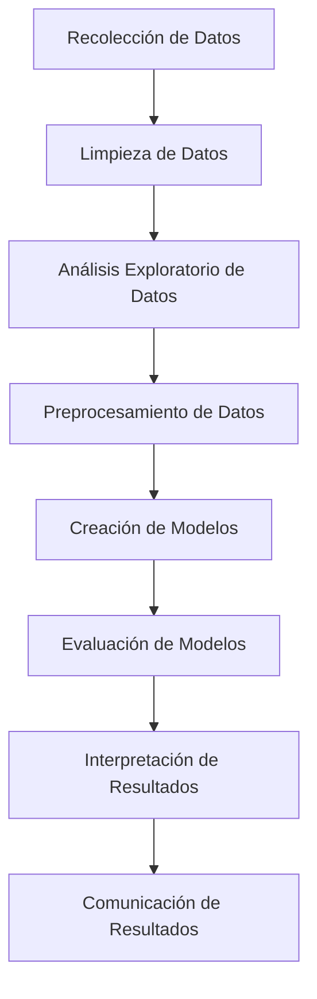

# Tópicos de rmarkdown, bookdown, shinyapps y dashboards

# Parte 0: Sintaxis en R Markdown

**Markdown** es un lenguaje de marcado ligero que puedes usar para añadir formato a texto en la web. Aquí te presento una lista de las sintaxis más comunes en Markdown:

1. **Encabezados**: Se crean utilizando el símbolo `#`. Cuantos más símbolos `#`, menor será el tamaño del encabezado. Por ejemplo:
    ```
    # Encabezado 1
    ## Encabezado 2
    ### Encabezado 3
    ```

2. **Negrita**: Se puede hacer un texto en negrita utilizando dos asteriscos `**` o dos guiones bajos `__` alrededor del texto. Por ejemplo:
    ```
    **texto en negrita**
    __texto en negrita__
    ```

3. **Cursiva**: Se puede hacer un texto en cursiva utilizando un asterisco `*` o un guión bajo `_` alrededor del texto. Por ejemplo:
    ```
    *texto en cursiva*
    _texto en cursiva_
    ```

4. **Listas**: Las listas se pueden crear utilizando un guión `-`, un asterisco `*`, o un número seguido de un punto `.`, para listas ordenadas. Por ejemplo:
    ```
    - Elemento de la lista
    * Elemento de la lista
    1. Primer elemento de la lista
    ```

5. **Enlaces**: Los enlaces se pueden crear utilizando corchetes `[]` para el texto del enlace y paréntesis `()` para la URL del enlace. Por ejemplo:
    ```
    [texto del enlace](https://www.ejemplo.com)
    ```

6. **Imágenes**: Las imágenes se pueden insertar de manera similar a los enlaces, pero con un signo de exclamación `!` antes de los corchetes. Por ejemplo:
    ```
    
    ```

7. **Código**: El código se puede representar utilizando comillas invertidas `` ` ``. Para bloques de código, puedes usar tres comillas invertidas seguidas de la identificación del lenguaje. Por ejemplo:

```
`código`
```

 Bloque de código:
 ```

Código de *Python*:
   ```python
   print("Hola, mundo!")
    ```

``` 

Código de *R*:

    ```r
    data(mtcars)
    ```

```

```

9. **Tablas**: Las tablas se pueden crear utilizando barras verticales `|` y guiones `-`. Por ejemplo:
    ```
    | Encabezado 1 | Encabezado 2 |
    | ------------ | ------------ |
    | Celda 1      | Celda 2      |
    ```

10. **Notas**: Las notas se pueden crear utilizando el símbolo `>` antes del texto. Por ejemplo:
    ```
    > Esto es una nota.
    ```

11. Esquemas de flujo Mermaid:

Un diagrama Mermaid que representa los pasos de un análisis en Data Science:




Estos son solo algunos ejemplos de lo que puedes hacer con Markdown. Es una herramienta poderosa y flexible para añadir formato a tu texto.


Para ver un ejemplo ver los siguientes links:
- Editor en linea [Stackedit](https://stackedit.io/).
- Tutorial de Markdown [Tutorial](https://tutorialmarkdown.com/guia)
- Tutorial de Rmarkdown en español [Tutorial](https://bookdown.org/gboccardo/manual-ED-UCH/introduccion-al-uso-de-rmarkdown-para-la-compilacion-de-resultados-de-rstudio-en-diferentes-formatos.html)  
## Parte 1: Instalación de rmarkdown y primeros documentos

## Parte 2: bookdown y dashboards


### Referencias
- R Markdown Cookbook: https://bookdown.org/yihui/rmarkdown-cookbook/
- bookdown: Authoring Books and Technical Documents with R Markdown: https://bookdown.org/yihui/bookdown/
- Mastering Shinnying [Link](https://mastering-shiny.org/index.html)
