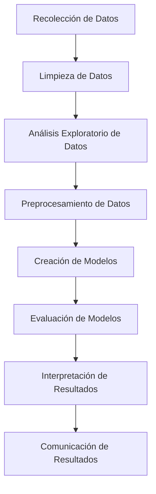

# Tópicos de rmarkdown, bookdown, shinyapps y dashboards

# Parte 0: Sintaxis en R Markdown

**Markdown** es un lenguaje de marcado ligero que puedes usar para añadir formato a texto en la web. Aquí te presento una lista de las sintaxis más comunes en Markdown:

1. **Encabezados**: Se crean utilizando el símbolo `#`. Cuantos más símbolos `#`, menor será el tamaño del encabezado. Por ejemplo:
    ```
    # Encabezado 1
    ## Encabezado 2
    ### Encabezado 3
    ```

2. **Negrita**: Se puede hacer un texto en negrita utilizando dos asteriscos `**` o dos guiones bajos `__` alrededor del texto. Por ejemplo:
    ```
    **texto en negrita**
    __texto en negrita__
    ```

3. **Cursiva**: Se puede hacer un texto en cursiva utilizando un asterisco `*` o un guión bajo `_` alrededor del texto. Por ejemplo:
    ```
    *texto en cursiva*
    _texto en cursiva_
    ```

4. **Listas**: Las listas se pueden crear utilizando un guión `-`, un asterisco `*`, o un número seguido de un punto `.`, para listas ordenadas. Por ejemplo:
    ```
    - Elemento de la lista
    * Elemento de la lista
    1. Primer elemento de la lista
    ```

5. **Enlaces**: Los enlaces se pueden crear utilizando corchetes `[]` para el texto del enlace y paréntesis `()` para la URL del enlace. Por ejemplo:
    ```
    [texto del enlace](https://www.ejemplo.com)
    ```

6. **Imágenes**: Las imágenes se pueden insertar de manera similar a los enlaces, pero con un signo de exclamación `!` antes de los corchetes. Por ejemplo:
    ```
    
    ```

7. **Código**: El código se puede representar utilizando comillas invertidas `` ` ``. Para bloques de código, puedes usar tres comillas invertidas seguidas de la identificación del lenguaje. Por ejemplo:

```
`código`
```

 Bloque de código:
 ```

Código de *Python*:
   ```python
   print("Hola, mundo!")
    ```

``` 

Código de *R*:

    ```r
    data(mtcars)
    ```

```

```

9. **Tablas**: Las tablas se pueden crear utilizando barras verticales `|` y guiones `-`. Por ejemplo:
    ```
    | Encabezado 1 | Encabezado 2 |
    | ------------ | ------------ |
    | Celda 1      | Celda 2      |
    ```

10. **Notas**: Las notas se pueden crear utilizando el símbolo `>` antes del texto. Por ejemplo:
    ```
    > Esto es una nota.
    ```

11. Esquemas de flujo Mermaid:

Un diagrama Mermaid que representa los pasos de un análisis en Data Science:




Estos son solo algunos ejemplos de lo que puedes hacer con Markdown. Es una herramienta poderosa y flexible para añadir formato a tu texto.


Para ver un ejemplo ver los siguientes links:
- Editor en linea [Stackedit](https://stackedit.io/).
- Tutorial de Markdown [Tutorial](https://tutorialmarkdown.com/guia)
- Tutorial de Rmarkdown en español [Tutorial](https://bookdown.org/gboccardo/manual-ED-UCH/introduccion-al-uso-de-rmarkdown-para-la-compilacion-de-resultados-de-rstudio-en-diferentes-formatos.html)  
## Parte 1: Instalación de rmarkdown y primeros documentos

### Contribuciones Principales de Yihui Xie

**Yihui Xie** es conocido por sus importantes contribuciones al ecosistema de R y la creación de herramientas que facilitan la reproducibilidad y la documentación de análisis de datos. A continuación, se presentan sus contribuciones más destacadas junto con enlaces a recursos y tutoriales relevantes:

1. **R Markdown:**
   - **Descripción:** R Markdown permite la creación de documentos dinámicos que combinan código R y texto, lo que facilita la generación de informes reproducibles.
   - **Recursos:**
     - [R Markdown: The Definitive Guide](https://bookdown.org/yihui/rmarkdown/)
     - [Documentación oficial de R Markdown](https://rmarkdown.rstudio.com/)

2. **knitr:**
   - **Descripción:** `knitr` es una herramienta que facilita la integración de código y resultados dentro de documentos de varios formatos.
   - **Recursos:**
     - [Dynamic Documents with R and knitr](https://yihui.org/knitr/)
     - [GitHub repository de knitr](https://github.com/yihui/knitr)

3. **bookdown:**
   - **Descripción:** `bookdown` es una extensión de R Markdown para la creación de libros y documentos largos. Permite organizar el contenido en capítulos y generar múltiples formatos de salida.
   - **Recursos:**
     - [Bookdown: Authoring Books and Technical Documents with R Markdown](https://bookdown.org/yihui/bookdown/)
     - [GitHub repository de bookdown](https://github.com/rstudio/bookdown)

4. **blogdown:**
   - **Descripción:** `blogdown` permite la creación y mantenimiento de sitios web y blogs usando R Markdown y Hugo, un generador de sitios estáticos.
   - **Recursos:**
     - [Blogdown: Creating Websites with R Markdown](https://bookdown.org/yihui/blogdown/)
     - [GitHub repository de blogdown](https://github.com/rstudio/blogdown)

### Instalación Correcta de R Markdown

Para instalar y configurar R Markdown correctamente, sigue estos pasos:

1. **Instalar R y RStudio:**
   - **R:** Asegúrate de tener R instalado en tu sistema. Puedes descargarlo desde [CRAN](https://cran.r-project.org/).
   - **RStudio:** Descarga e instala RStudio, que es un entorno de desarrollo integrado (IDE) para R. Puedes descargarlo desde [RStudio](https://rstudio.com/products/rstudio/download/).

2. **Instalar el Paquete rmarkdown:**
   - Abre RStudio y ejecuta el siguiente código para instalar `rmarkdown`:
     ```r
     install.packages("rmarkdown")
     ```

3. **Instalar Dependencias:**
   - Asegúrate de tener todos los paquetes necesarios para generar documentos en los diferentes formatos (HTML, PDF, Word).
   - Para documentos PDF, necesitas tener una distribución de LaTeX instalada. Puedes instalar TinyTeX, una versión liviana de LaTeX, con el siguiente comando:
     ```r
     install.packages("tinytex")
     tinytex::install_tinytex()
     ```

4. **Crear un Documento R Markdown:**
   - En RStudio, ve a `File` -> `New File` -> `R Markdown...`.
   - Completa el título, autor y elige el formato de salida (HTML, PDF, Word).
   - RStudio generará una plantilla básica de R Markdown que puedes modificar.

5. **Compilar el Documento:**
   - Haz clic en el botón `Knit` en la barra de herramientas de RStudio.
   - Selecciona el formato de salida deseado. RStudio ejecutará el código R en los chunks y generará el documento en el formato seleccionado.

### Ejemplo de Documento R Markdown

Aquí tienes un ejemplo simple de un documento R Markdown:

```markdown
---
title: "Ejemplo de R Markdown"
author: "Tu Nombre"
date: "2024-06-25"
output: html_document
---

# Introducción

Este es un ejemplo de un documento **R Markdown**. Puedes escribir texto normalmente y agregar código R.

## Análisis de Datos

A continuación, un análisis de ejemplo utilizando el conjunto de datos `mtcars`.

```{r}
summary(mtcars)
```

## Visualización de Datos

```{r}
plot(mtcars$wt, mtcars$mpg, main="Gráfico de Dispersión", xlab="Peso", ylab="Millas por Galón")
```
```


## Parte 2: bookdown y dashboards


### Referencias
- R Markdown Cookbook: https://bookdown.org/yihui/rmarkdown-cookbook/
- bookdown: Authoring Books and Technical Documents with R Markdown: https://bookdown.org/yihui/bookdown/
- Mastering Shinnying [Link](https://mastering-shiny.org/index.html)
