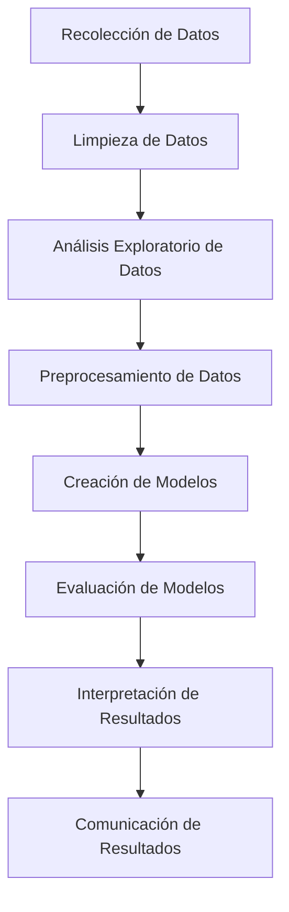

# Titulo: random
## sub 1
### sub 2
#### sub 3
##### sub 5

**NEGRITA**
*CURSIVA*

1. FUNCIONES
2. OBJETOS TRANSFORMABLES
3. ETC

 [CURSO DE R- JAIME lINCOVIL](https://github.com/jelincovil/A_course_R_programming_2024/tree/main/Unidad%20VIII)

  

  
| Encabezado 1 | Encabezado 2 |
| ------------ | ------------ |
| Celda 1      | Celda 2      |

